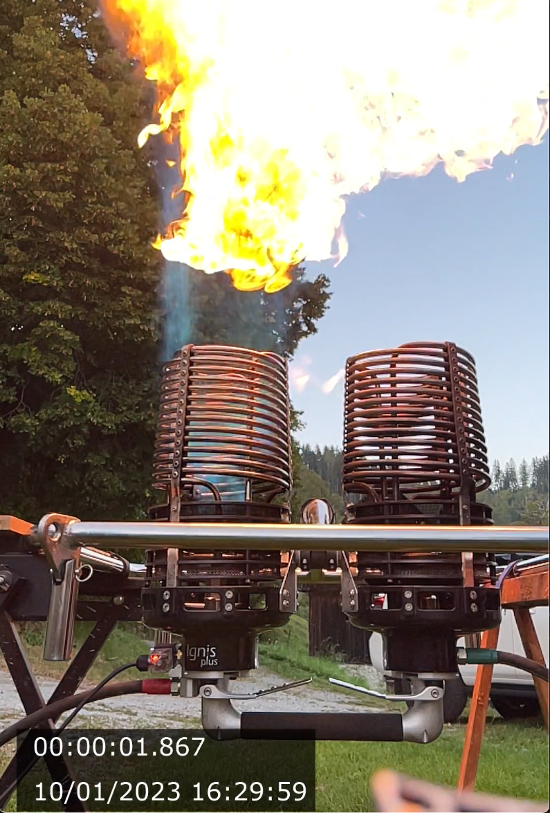

# qtimetag: tag a Quicktime movie with start time and frame offset

I had the need to tag iPhone movies with start time and precise time offset to correlate the video with other signal recordings.

one off, unpolished but works

## installation

`pip install logzero ffmpeg-python`

## example invocation
`qtimetag.py --start 00:00:01 --end 00:00:2 IMG_3298.MOV`

this will create the time-tagged video in `IMG_3298_ts.MOV`

## output example

